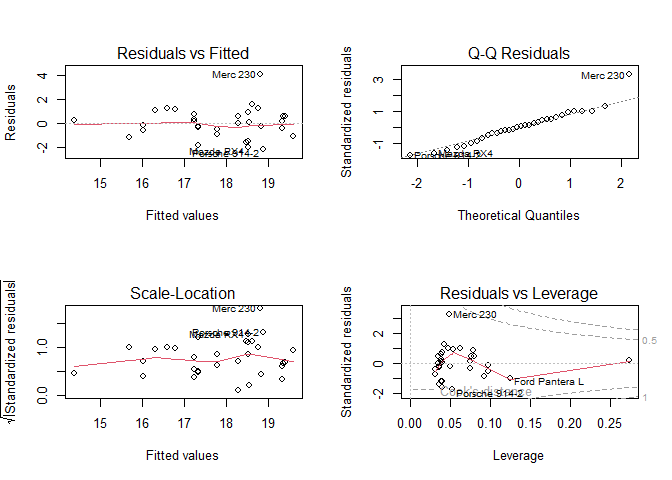
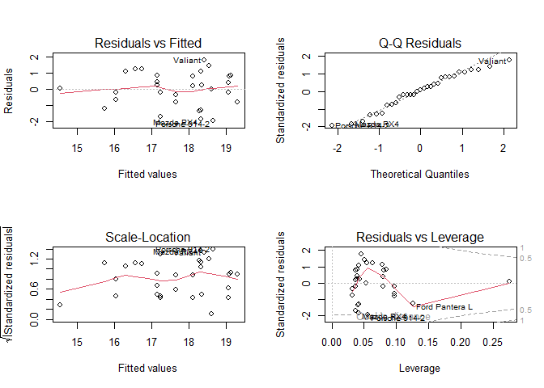
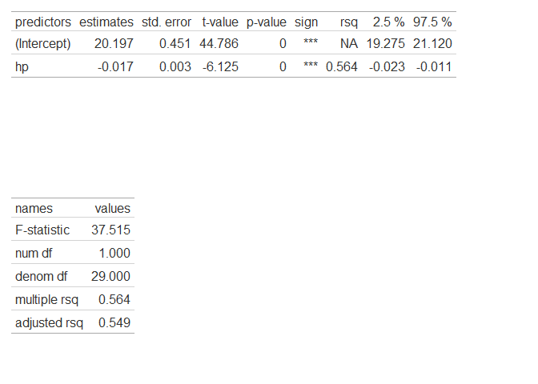
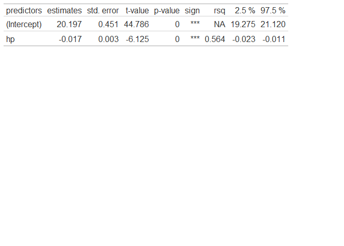

<!-- README.md is generated from README.Rmd. Please edit that file -->

# easylm

<!-- badges: start -->

<!-- badges: end -->

The goal of easylm is to provide a limited number of functions to
analyze linear models.

## Installation

You can install the development version of easylm like so:

``` r
devtools::install_github("ArthurDejean/easylm")
```

For the functions of this package to work, you need to install these
fairly common packages in data analysis.

Here is a simple script to install them in your personal R environment :

``` r
packages = c("tidyverse", "knitr", "stats", "car", "lmtest", "tseries", "rsq", "broom", "gt", "patchwork")

for (element in packages) {
  if (require(element, character.only=T) == FALSE) {
    install.packages(element)
    require(element, character.only=T)
  } else {
    require(element, character.only=T)
  }
}

rm(packages,element)
```

## Example

This is a basic example of use of the two functions of this package

``` r
library(easylm)
M = lm(qsec~hp, mtcars)
lm_check(M)
#> Le chargement a nécessité le package : knitr
#> Le chargement a nécessité le package : tseries
#> Registered S3 method overwritten by 'quantmod':
#>   method            from
#>   as.zoo.data.frame zoo
#> Le chargement a nécessité le package : lmtest
#> Le chargement a nécessité le package : car
#> lm(formula = qsec ~ hp, data = mtcars)
#> 
#> 
#> Table: VÉRIFICATION DES CONDITIONS D'APPLICATION POUR LE MODÈLE LINÉAIRE
#> 
#> |                          |test          |statistic |p-value    |sign |
#> |:-------------------------|:-------------|:---------|:----------|:----|
#> |Normalité de distribution |Jarque-Bera   |7.214823  |0.02712197 |*    |
#> |Homogénéité des variances |Breusch-Pagan |1.140412  |0.2855654  |NS   |
#> |Indépendance              |Durbin-Watson |1.234889  |0.018      |*    |
```



    #> 
    #> ------------------------------------
    #> RECHERCHE D'OUTLIERS
    #> 
    #> Test de Bonferroni pour les outliers
    #>          rstudent unadjusted p-value Bonferroni p
    #> Merc 230  4.02133         0.00037754     0.012081
    #> Warning in lm_check(M): NAs introduits lors de la conversion automatique
    #> 
    #> 
    #> Table: LEVIERS, RSS & D DE COOKS LES PLUS ELEVES
    #> 
    #> |                  | ID|levier    | ID|RSS       | ID|RSS        | ID|cooksD    |
    #> |:-----------------|--:|:---------|--:|:---------|--:|:----------|--:|:---------|
    #> |Maserati Bora     | NA|0.2745929 | NA|4.0213296 | NA|-1.8085079 | NA|0.2801482 |
    #> |Ford Pantera L    | NA|0.1256885 | NA|1.2910053 | NA|-1.6951920 | NA|0.0842883 |
    #> |Duster 360        | NA|0.0975751 | NA|0.9941890 | NA|-1.4793640 | NA|0.0700018 |
    #> |Camaro Z28        | NA|0.0975751 | NA|0.9925039 | NA|-1.2615787 | NA|0.0570628 |
    #> |Honda Civic       | NA|0.0927742 | NA|0.9674284 | NA|-1.2079576 | NA|0.0401581 |
    #> |Merc 240D         | NA|0.0804652 | NA|0.8981819 | NA|-0.9864145 | NA|0.0397150 |
    #> |Chrysler Imperial | NA|0.0788800 | NA|0.7218149 | NA|-0.8779528 | NA|0.0367861 |
    #> |Toyota Corolla    | NA|0.0770401 | NA|0.6028815 | NA|-0.7211694 | NA|0.0347661 |
    #> |Fiat 128          | NA|0.0759259 | NA|0.4811460 | NA|-0.5058751 | NA|0.0332855 |
    #> |Fiat X1-9         | NA|0.0759259 | NA|0.4719652 | NA|-0.3807795 | NA|0.0317025 |
    #> Levier moyen = 0.0625 
    #> critère sur le levier : si un levier est plus élevé que 2 fois le levier moyen, alors c'est outlier.
    #> Critère sur le RSS : si un |RSS| est supérieur à 3, alors c'est un outlier.
    #> critère sur le D de Cook : si un D est supérieur à 1 et/ou se distingue des autres, alors c'est un outlier.
    #> 
    #> ------------------------------------
    #According to the Bonferroni test for outliers, Merc 230 is an outlier.

    M = lm(qsec~hp, subset(mtcars, rownames(mtcars) != "Merc 230"))
    lm_check(M) # we are going to ignore the independency of residuals issue for this example.
    #> lm(formula = qsec ~ hp, data = subset(mtcars, rownames(mtcars) != 
    #>     "Merc 230"))
    #> 
    #> 
    #> Table: VÉRIFICATION DES CONDITIONS D'APPLICATION POUR LE MODÈLE LINÉAIRE
    #> 
    #> |                          |test          |statistic |p-value   |sign |
    #> |:-------------------------|:-------------|:---------|:---------|:----|
    #> |Normalité de distribution |Jarque-Bera   |1.284943  |0.5259908 |NS   |
    #> |Homogénéité des variances |Breusch-Pagan |0.7505379 |0.386306  |NS   |
    #> |Indépendance              |Durbin-Watson |1.04794   |0.002     |**   |



    #> 
    #> ------------------------------------
    #> RECHERCHE D'OUTLIERS
    #> 
    #> Test de Bonferroni pour les outliers
    #> No Studentized residuals with Bonferroni p < 0.05
    #> Largest |rstudent|:
    #>                rstudent unadjusted p-value Bonferroni p
    #> Porsche 914-2 -2.026936           0.052287           NA
    #> Warning in lm_check(M): NAs introduits lors de la conversion automatique
    #> 
    #> 
    #> Table: LEVIERS, RSS & D DE COOKS LES PLUS ELEVES
    #> 
    #> |                  | ID|levier    | ID|RSS       | ID|RSS        | ID|cooksD    |
    #> |:-----------------|--:|:---------|--:|:---------|--:|:----------|--:|:---------|
    #> |Maserati Bora     | NA|0.2759220 | NA|1.8334007 | NA|-2.0269356 | NA|0.1136387 |
    #> |Ford Pantera L    | NA|0.1258014 | NA|1.4560302 | NA|-1.9162486 | NA|0.1085390 |
    #> |Duster 360        | NA|0.0975889 | NA|1.2607528 | NA|-1.7508486 | NA|0.0747058 |
    #> |Camaro Z28        | NA|0.0975889 | NA|1.2449154 | NA|-1.3731091 | NA|0.0739222 |
    #> |Honda Civic       | NA|0.0971970 | NA|1.1177854 | NA|-1.3013108 | NA|0.0553202 |
    #> |Merc 240D         | NA|0.0844173 | NA|1.0836691 | NA|-1.2699327 | NA|0.0545132 |
    #> |Toyota Corolla    | NA|0.0808562 | NA|0.8481187 | NA|-0.7975804 | NA|0.0530440 |
    #> |Fiat 128          | NA|0.0796971 | NA|0.8251165 | NA|-0.7608351 | NA|0.0526593 |
    #> |Fiat X1-9         | NA|0.0796971 | NA|0.7964149 | NA|-0.6376879 | NA|0.0440069 |
    #> |Chrysler Imperial | NA|0.0788831 | NA|0.7596739 | NA|-0.3428339 | NA|0.0391106 |
    #> Levier moyen = 0.06451613 
    #> critère sur le levier : si un levier est plus élevé que 2 fois le levier moyen, alors c'est outlier.
    #> Critère sur le RSS : si un |RSS| est supérieur à 3, alors c'est un outlier.
    #> critère sur le D de Cook : si un D est supérieur à 1 et/ou se distingue des autres, alors c'est un outlier.
    #> 
    #> ------------------------------------

    lm_sum(M)
    #> Le chargement a nécessité le package : rsq
    #> Le chargement a nécessité le package : broom
    #> Le chargement a nécessité le package : gt
    #> Warning: le package 'gt' a été compilé avec la version R 4.5.3
    #> Le chargement a nécessité le package : patchwork
    #> Warning: Dans lm.fit(x, y, offset = offset, singular.ok = singular.ok, ...) :
    #> l'argument supplémentaire 'family' sera ignoré
    #> 
    #> 
    #> Table: Each predictor statistics
    #> 
    #> |predictors  | estimates| std. error| t-value| p-value|sign |   rsq|  2.5 %| 97.5 %|
    #> |:-----------|---------:|----------:|-------:|-------:|:----|-----:|------:|------:|
    #> |(Intercept) |    20.197|      0.451|  44.786|       0|***  |    NA| 19.275| 21.120|
    #> |hp          |    -0.017|      0.003|  -6.125|       0|***  | 0.564| -0.023| -0.011|
    #> 
    #> 
    #> Table: Entire model statistics
    #> 
    #> |names        | values|
    #> |:------------|------:|
    #> |F-statistic  | 37.515|
    #> |num df       |  1.000|
    #> |denom df     | 29.000|
    #> |multiple rsq |  0.564|
    #> |adjusted rsq |  0.549|

    #If you want to display this tab in a plot
    lm_sum(M, plot = TRUE)
    #> Warning: Dans lm.fit(x, y, offset = offset, singular.ok = singular.ok, ...) :
    #> l'argument supplémentaire 'family' sera ignoré



``` r

#If you want the predictors statistics only
lm_sum(M, plot = TRUE, type = "pred")
#> Warning: Dans lm.fit(x, y, offset = offset, singular.ok = singular.ok, ...) :
#> l'argument supplémentaire 'family' sera ignoré
```



You’ll still need to render `README.Rmd` regularly, to keep `README.md`
up-to-date. `devtools::build_readme()` is handy for this.

You can also embed plots, for example:


In that case, don’t forget to commit and push the resulting figure
files, so they display on GitHub and CRAN.
